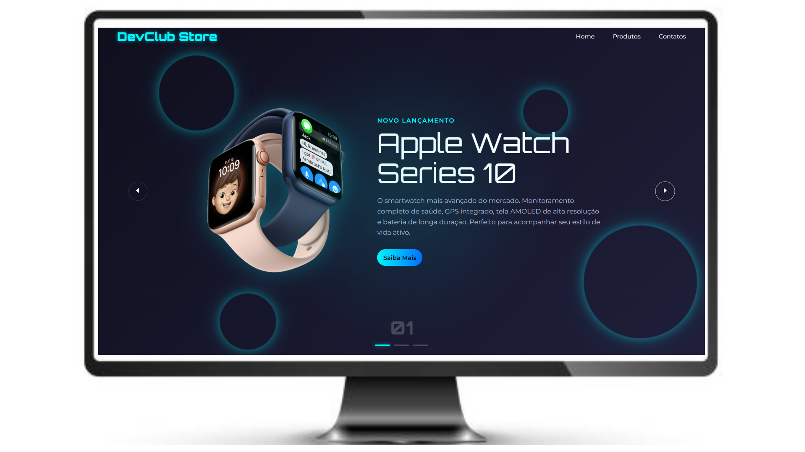

<h1>DevClub Store</h1>
<h2>📄 Sobre o projeto: </h2>

Projeto desenvolvido no Canal do youtube de @Rodolfo Mori. Site bastante visual e interativo. O dinamismo  do site não depende apenas da ação do usuário, pois o proprio site consegue criar ações sem precisa de nenhum clique. Foi feito apenas a versão Desktop mas a implementação Mobile já esta sendo iniciada. 👀

<h2>🔧 Ferramentas Utilizadas no Projeto:</h2>
 

   
    
   
 

 <h2>📷 Imagem:</h2>
 
 

